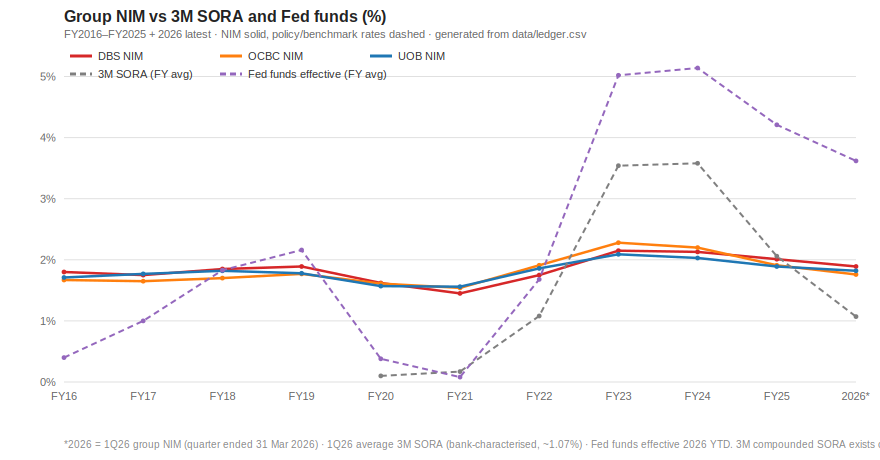

# Analysis of Singapore Banks — DBS · OCBC · UOB

## Purpose

**Thesis.** Over a 10–15 year horizon, Singapore keeps attracting and growing the wealth the world parks and moves through it, and DBS, OCBC and UOB monetize that growing capital base — deposits and wealth AUM — into income and are valued accordingly. The decisive signal is **capital-attraction momentum**: if deposit and wealth-AUM growth stalls or reverses, the thesis dies with it.

**Key questions this analysis answers** *(each is answered in the Conclusions below)*:

**A. Capital attraction — the primary driver**

1. What is the trend for Deposits and Wealth AUM?
2. What is the trend in wealth-hub capital flows over the last 5 years?

**B. Monetization — secondary (expected to follow attraction)**

3. What is the trend in NII and Other Revenue?
4. How volatile and cyclical is NIM?
5. What is the monetization score of the SG banks versus benchmark peers?

**C. Relative valuations**

6. What is the relative valuation premium of the SG banks versus benchmark peers, and what annual growth outperformance over the next 5 years would justify it?

**Scope.** DBS (SGX: D05) · OCBC (O39) · UOB (U11) · FY2016–FY2025 (31-Dec year-ends) + 1Q2026 interim (quarters ended 31 Mar 2026) + current (2026-07-20 intraday) valuation · **SGD only** · notation and formats in Appendix D.

> **This is not financial advice.** It is a demonstration of the use of AI in business analysis.

---

## How this report was made

This report is produced by a documented, AI-run workflow, fully version-controlled in a public GitHub repository: [hmhc-ai/hmhc-reports](https://github.com/hmhc-ai/hmhc-reports). **Instruction files** (`.md`) instruct the AI how to perform each task (similar to a standard operating procedure); **data files** are plain CSV and markdown (for example recent signals or insights). The general structure of the workflow is as follows:

- `guides/` — HUMAN-OWNED — the questions & rules the AI must follow
  - [`frame.md`](https://github.com/hmhc-ai/hmhc-reports/blob/main/pipeline/sg-banks/guides/frame.md) — the key questions we are trying to answer from the analysis
  - `style.md` — formatting & marking rules
- `method/` — one instruction file per step; the verb is the category (`fetch-` web · `reconcile-` cross-check · `build-` assembly · `write-` insight)
  - [`AGENTS.md`](https://github.com/hmhc-ai/hmhc-reports/blob/main/AGENTS.md) — the ground rules every AI agent reads before working in this repo
  - [`UPDATE.md`](https://github.com/hmhc-ai/hmhc-reports/blob/main/pipeline/sg-banks/UPDATE.md) — intelligent instruction routing of user prompts
  - `method/ai/` — steps performed by AI models
    - `fetch-ledger.md` → [`data/ledger.csv`](https://github.com/hmhc-ai/hmhc-reports/blob/main/pipeline/sg-banks/data/ledger.csv) — multiple agents retrieve & compare data
    - `fetch-signals.md` → [`data/signals.md`](https://github.com/hmhc-ai/hmhc-reports/blob/main/pipeline/sg-banks/data/signals.md) — dated, sourced qualitative signals
    - `reconcile-ledger.md` → reconciled ledger columns — human + AI cross-check of the fetched data
    - `write-conclusions.md` → Conclusions — closed-book answers to the key questions + thesis score
    - `build-report.md` → [**`report.md`**](https://github.com/hmhc-ai/hmhc-reports/commits/main/reports/sg-banks/report.md) — assembling this publicized report
  - `method/code/` — steps performed by deterministic programs, no AI (same input → same output, verified by automated checks)
    - `build_tables.py` → `data/tables.md` — all table arithmetic, regenerated from the ledger
    - `build_charts.py` → `assets/` charts — all figures drawn from the ledger

The instruction files are themselves living documents: the AI reviews and refines them run over run — a continuous self-improvement cycle, with every revision version-controlled and traceable in the repository's history.

---

<!-- conclusions:start -->
## Conclusions — Answers to the Key Questions

1. **[+] Trend for Deposits and Wealth AUM** — Growing at every bank: wealth AUM outpaces deposits, and growth accelerated through FY24–25 at DBS and OCBC while UOB compounds steadily.

   | Bank_Metric | S$bn | CASA % | 5y-CAGR | FY25 % | FY24 % | FY23 % | FY22 % |
   |---|---:|---:|---:|---:|---:|---:|---:|
   | DBS_Deposits | 610 | 54.5 | 5.6% | +8.6 | +5.0 | +1.5 | +5.0 |
   | DBS_WealthAUM | 488 |  | 13.1% | +14.6 | +16.7 | +22.9 | +2.1 |
   | DBS_CapitalBase | 1,098 |  | 8.5% | +11.2 | +9.7 | +9.2 | +3.9 |
   | OCBC_Deposits | 428 | 50.7 | 6.3% | +9.6 | +7.4 | +3.9 | +2.2 |
   | OCBC_WealthAUM | 343 |  | 7.3% | +14.7 | +13.7 | +1.9 | +0.0 |
   | OCBC_CapitalBase | 771 |  | 6.8% | +11.8 | +10.0 | +3.1 | +1.3 |
   | UOB_Deposits | 426 | 58.4 | 5.6% | +5.4 | +4.9 | +4.5 | +4.5 |
   | UOB_WealthAUM | 201 |  | 8.4% | +5.8 | +8.0 | +14.3 | +10.8 |
   | UOB_CapitalBase | 627 |  | 6.4% | +5.6 | +5.9 | +7.4 | +6.3 |

   *Levels and CASA % as of FY25. 5y-CAGR = FY2020→FY2025; each FYxx % = that FY's YoY growth. **Capital Base = customer deposits + wealth AUM** — included to test how consistent the AUM/deposit/capital-base definitions are: AUM definitions differ per bank (DBS "Wealth Management AUM"; OCBC group wealth incl. Bank of Singapore + Great Eastern; UOB narrower, reclassified 1-Jan-2023), so capital-base *levels* are not cross-comparable — read within-bank trends. Secondary (1Q26): DBS deposits reached S$630bn with a record S$492bn AUM (+17% YoY cc, +S$10bn net new money); UOB added +S$1bn net new money. Sources: Tables 1–2; 1Q2026 attraction table; Signals — DBS 2026-04-30, UOB 2026-05-07.*

2. **Wealth-hub capital flows, last 5 years** — Pending new research module — not answerable from current data.

   *Module ready: `ai/fetch-flows.md` — run pending (non-Claude fetch, e.g. Perplexity Computer; cost-gated). Format per frame Q2: `WealthHub: US$tn, 5y-CAGR %, FY25 %, FY24 %, FY23 %, FY22 %`.*

3. **[+] Trend in NII and Other Revenue** — Both engines compounded high-single-digit over five years, but the yearly columns show the rate cycle plainly: NII surged +25–31% in FY22–23 and stalled or fell in FY25, with Other Revenue picking up the slack at DBS and OCBC but not UOB.

   | Bank_Metric | S$bn | 5y-CAGR | FY25 % | FY24 % | FY23 % | FY22 % |
   |---|---:|---:|---:|---:|---:|---:|
   | DBS_NII | 14.5 | 9.8% | +0.5 | +5.7 | +24.7 | +29.6 |
   | DBS_OR | 8.4 | 8.8% | +6.7 | +20.4 | +17.6 | −5.1 |
   | OCBC_NII | 9.2 | 8.9% | −6.2 | +1.1 | +25.5 | +31.3 |
   | OCBC_OR | 5.5 | 5.5% | +15.8 | +22.2 | +7.3 | −24.1 |
   | UOB_NII | 9.4 | 9.2% | −3.3 | −0.1 | +16.0 | +30.6 |
   | UOB_OR | 4.5 | 7.2% | −3.6 | +8.6 | +31.6 | −5.0 |

   *Levels as of FY25. OR = total income − NII (derived from reported figures). 5y-CAGR = FY2020→FY2025; each FYxx % = that FY's YoY growth. OCBC FY22 OR reflects the SFRS(I) 17 insurance restatement. Sources: Tables 1 ×3; Appendix C.*

4. **[±] NIM volatility and cyclicality** — Highly cyclical, tracking the Fed → SORA transmission with a lag: every bank troughed in FY2021 (DBS 1.45% · OCBC 1.54% · UOB 1.56%), peaked in FY2023 (2.15% · 2.28% · 2.09%) as SORA averaged ~3.5%, and is compressing again as SORA fell to ~1.07% in 1Q26 (NIM 1.89% · 1.76% · 1.82%, all down YoY).

   

   *Chart generated deterministically from `data/ledger.csv` by `method/code/build_charts.py` (CI-verified). Intra-cycle swing ≈ 53–74bps trough-to-peak — large enough that NII alone cannot anchor income, which is why the fee/wealth offset (Q3) matters. NIM's amplitude is far smaller than the policy rates' (~5pp Fed swing → ~0.7pp NIM swing): deposit franchises damp the cycle. Sources: Table 5; 1Q2026 income table.*

5. **[±] Monetization score vs benchmark peers** — Peer index pending: `ai/fetch-peers.md` is ready, run cost-gated (non-Claude fetch); `code/build_benchmarks.py` computes the indices the moment peer data lands. The SG banks' own FY25 values, ahead of indexing: `Monetization_vDeposits` 3.75% DBS · 3.41% OCBC · 3.24% UOB; `Monetization_vCapitalBase` 2.09% · 1.89% · 2.20% — UOB ranks highest on the second metric largely because its reported AUM base is narrowest, illustrating why the two indices are read together. Top Other-Revenue categories (FY25, % of total revenue): DBS net fees ≈21%; OCBC wealth income ≈38%; UOB net fees ≈19%.

   *Definitions: `Monetization_vDeposits` = total revenue ÷ customer deposits; `Monetization_vCapitalBase` = total revenue ÷ (customer deposits + wealth AUM). Category notes: DBS net fees led by wealth fees and cards; OCBC wealth income includes Great Eastern insurance and NII on wealth deposits per OCBC's definition; UOB net fees span cards, wealth and loan-related. Modules ready: `ai/fetch-peers.md` (run pending) + `code/build_benchmarks.py` (index bank HSBC = 100). Sources: Tables 1; Appendix B.*

6. **Relative valuation premium vs benchmark peers, and the 5-year growth outperformance required** — Pending new research module — not answerable from current data (modules ready; peer fetch cost-gated). What current data does show: the three trade at 2.96 / 2.14 / 1.45 P/B — 96% / 84% / 24% above their own 10-yr averages — so the premium question versus peers is live, not hypothetical.

   *Modules ready: `ai/fetch-peers.md` (run pending) + `code/build_benchmarks.py` — four indexes (P/CapitalBase, P/Rev, P/E, P/B) vs HSBC = 100; required outperformance = (premium)^(1/5) − 1 per index over a 5-year convergence horizon. Sources: Table 4; 1Q2026 valuation table.*

**Thesis score: 70/100.** The primary driver is intact and verified: deposits, wealth AUM and the combined capital base compound mid-single-digit-plus at every bank with FY24–25 growth above the 5-year trend at DBS and OCBC (Q1), and monetization has followed the base over the cycle (Q3), albeit with heavy NIM cyclicality that the fee engine currently offsets at two of three banks (Q4). The score is capped because the entire relative-valuation pillar (Q5 index, Q6) and the cross-hub flows test of the attraction claim (Q2) await their research modules — and the banks' multiples already sit far above their own history. Decision rule: capital-attraction momentum is **positive** — no stall or reversal — so the kill signal is not triggered.

*Scope: questions from `guides/frame.md` (6 questions, formats per its internal notes, 2026-07-22); grounded in report.md + data/signals.md (v2026.07.22-r6). Not investment advice.*
<!-- conclusions:end -->

---

## Key Data

<!-- FUTURE WORKFLOW (TBD): per-table notes for latest-quarter actuals & executive forecasts will be added here. Not built yet. -->

### 1Q2026 interim (quarter ended 31 Mar 2026)

#### 1Q2026 — income & returns (S$m unless %)

| Metric (1Q26) | DBS | OCBC | UOB | Note |
|---|---:|---:|---:|---|
| Net interest income | 3,494 | 2,222 | 2,324 | all down ~4–5% YoY; UOB Tier-2 host |
| Non-interest income | 2,454 | 1,606 | 1,098 | derived (TI−NII); UOB slide components don't reconcile (see notes) |
| Total income | 5,948 | 3,828 | 3,422 | records at DBS & OCBC |
| Net fee income | 1,482 | 675 | 637 | DBS +16% · OCBC +24% · UOB −8% YoY |
| Net profit | 2,930 | 1,974 | 1,437 | +1% / +5% / −4% YoY |
| Group NIM (%) | 1.89 | 1.76 | 1.82 | all down YoY; OCBC steepest (−28bps) |
| ROE (%) | 17.0 | 13.0 | 11.5 | reported (group) |
| Cost/income (%) | 38.7 | 39.3 | 44.5 | |

*NII + Non-II = Total income ties exactly for all three (DBS 3,494+2,454=5,948 · OCBC 2,222+1,606=3,828 · UOB 2,324+1,098=3,422). DBS non-II derived (fee 1,482 + other 972); OCBC NII derived-to-tie (press release prints NII ≈ "S$2.22bn"). **UOB non-II caveat:** UOB's CFO-slide component split (net fee 637 + trading & investment 405 + other 462 = 1,504) does **not** reconcile with total income − NII (1,098); the tie-out-consistent derived 1,098 is used and the slide split is flagged as an unresolved retrieval gap. Sources: [DBS 1Q26 Trading Update](https://www.dbs.com/iwov-resources/images/investors/quarterly-financials/2026/1Q26_trading_update.pdf); [OCBC 1Q26 Press Release](https://www.ocbc.com/group/media/release/2026/ocbc-group-first-quarter-2026-net-profit-up-5percent.page); [OCBC 1Q26 Results (SGX PDF)](https://links.sgx.com/FileOpen/OCBC_1Q26_Results_Press_Release.ashx?App=Announcement&FileID=888006); [UOB 1Q26 CFO Slides (via MarketScreener)](https://www.marketscreener.com/news/united-overseas-bank-uob-group-1q26-trading-update-cfo-slides-ce7f58d2d18df127); [UOB Financial Highlights](https://www.uobgroup.com/investor-relations/financial/financial-highlights.html).*

#### 1Q2026 — attraction, balance sheet & asset quality (period-end 31 Mar 2026)

| Metric | DBS | OCBC | UOB | Note |
|---|---:|---:|---:|---|
| Customer deposits (S$m) | 629,868 | 444,000 | 427,000 | |
| CASA ratio (%) | 55.0 | 50.2 | 57.0 | printed / mix basis differs |
| Wealth AUM (S$m) | 492,000 | 342,000 | 198,000 | **definitions differ — do not compare levels** |
| Total assets (S$m) | 935,365 | 703,124 | 574,000 | leverage only, not attraction |
| Gross loans (S$m) | 453,180 | 347,000 | 354,000 | |
| CET1 ratio (%) | 16.9 | 17.0 | 15.3 | |
| NPL ratio (%) | 1.0 | 0.9 | 1.5 | |
| Credit cost (bps) | 14 | 23 | 26 | OCBC incl. S$191m overlay; UOB elevated |

***Never sum deposits + AUM** (double-count). Wealth-AUM levels are **not** cross-comparable — DBS "Wealth Management AUM"; OCBC group wealth incl. Bank of Singapore + Great Eastern; UOB "Group Retail AUM" (narrower, reclassified 1-Jan-2023). DBS record wealth AUM S$492bn (+17% YoY cc), net new money +S$10bn ([DBS 1Q26 CFO presentation](https://www.dbs.com/iwov-resources/images/investors/quarterly-financials/2026/1Q26_CFO_presentation.pdf)). OCBC credit cost includes S$191m management-overlay allowances for non-impaired assets ([OCBC 1Q26 Press Release](https://www.ocbc.com/group/media/release/2026/ocbc-group-first-quarter-2026-net-profit-up-5percent.page)). UOB credit cost 26bps with Greater-China NPAs rising ([Bloomberg, 6 May 2026](https://www.bloomberg.com/news/articles/2026-05-06/uob-profit-dips-on-lending-income-ceo-says-uncertainty-elevated)). UOB balance-sheet/ratio lines are Tier-1 ([UOB Financial Highlights](https://www.uobgroup.com/investor-relations/financial/financial-highlights.html)); UOB CASA / wealth AUM / credit cost are Tier-2 host ([UOB 1Q26 CFO Slides](https://www.marketscreener.com/news/united-overseas-bank-uob-group-1q26-trading-update-cfo-slides-ce7f58d2d18df127)).*

#### 1Q2026 — current valuation (as of 2026-07-20, intraday)

| Metric | DBS | OCBC | UOB |
|---|---:|---:|---:|
| Price (S$, intraday 2026-07-20) | 71.96 | 28.60 | 42.60 |
| FY2025 BVPS (S$) | 24.29 | 13.38 | 29.36 |
| Current P/B | 2.96 | 2.14 | 1.45 |
| Current vs 10-yr avg P/B | +96% | +84% | +24% |
| FY2025 TBVPS (S$) | 22.07 | 12.41 | 26.36 |
| Current P/TB | 3.26 | 2.30 | 1.62 |

*Prices are **intraday 2026-07-20 (Perplexity Finance, SGX open) — NOT closing prices**; treat as a tier-2 market-data snapshot only. P/B = price ÷ FY2025 BVPS; P/TB = price ÷ FY2025 TBVPS (FY2025 per-share book denominators; 1Q26 per-share book not retrieved). All three continue to trade well above their own 10-yr average P/B (1.51 / 1.16 / 1.17), richest at DBS. These figures update the Table 4 "Current P/B" rows and the P/TB "current" column below.*

---

### Table 1 — DBS: Income Engine

| FY | Dep | Assets | NII | Other | TotalRev | Profit | NIM | Rev/Dep | Profit/Dep | Profit/Rev |
|---|---:|---:|---:|---:|---:|---:|---:|---:|---:|---:|
| 2016 | 347 | 482 | 7.3 | 4.2 | 11.5 | 4.2 | 1.80% | 0.033 | 0.012 | 0.37 |
| 2017 | 374 | 518 | 7.8 | 4.1 | 11.9 | 4.4 | 1.75% | 0.032 | 0.012 | 0.37 |
| 2018 | 394 | 551 | 9.0 | 4.2 | 13.2 | 5.6 | 1.85% | 0.033 | 0.014 | 0.43 |
| 2019 | 404 | 579 | 9.6 | 4.9 | 14.5 | 6.4 | 1.89% | 0.036 | 0.016 | 0.44 |
| 2020 | 465 | 650 | 9.1 | 5.5 | 14.6 | 4.7 | 1.62% | 0.031 | 0.010 | 0.32 |
| 2021 | 502 | 686 | 8.4 | 5.9 | 14.3 | 6.8 | 1.45% | 0.028 | 0.014 | 0.48 |
| 2022 | 527 | 743 | 10.9 | 5.6 | 16.5 | 8.2 | 1.75% | 0.031 | 0.016 | 0.50 |
| 2023 | 535 | 739 | 13.6 | 6.5 | 20.2 | 10.3 | 2.15% | 0.038 | 0.019 | 0.51 |
| 2024 | 562 | 827 | 14.4 | 7.9 | 22.3 | 11.4 | 2.13% | 0.040 | 0.020 | 0.51 |
| 2025 | 610 | 897 | 14.5 | 8.4 | 22.9 | 11.0 | 2.01% | 0.038 | 0.018 | 0.48 |
| **CAGR 21→25** | 5.0% | 6.9% | 14.5% | 9.4% | 12.5% | 12.9% |  |  |  |  |
| **CAGR 16→25** | 6.5% | 7.2% | 7.9% | 8.1% | 8.0% | 11.2% |  |  |  |  |

*Other = TotalRev − NII (derived). TotalRev = reported total income. Rev/Dep = TotalRev ÷ Deposits; Profit/Dep = Profit ÷ Deposits; Profit/Rev = Profit ÷ TotalRev (all dimensionless). CAGR = (end/start)^(1/n) − 1, on FY2021→FY2025 (4-yr) and FY2016→FY2025 (9-yr) bases. NIM = group net interest margin as reported. Profit = net profit attributable to shareholders (reported).*

### Table 1 — OCBC: Income Engine

| FY | Dep | Assets | NII | Other | TotalRev | Profit | NIM | Rev/Dep | Profit/Dep | Profit/Rev |
|---|---:|---:|---:|---:|---:|---:|---:|---:|---:|---:|
| 2016 | 261 | 410 | 5.1 | 3.4 | 8.5 | 3.5 | 1.67% | 0.032 | 0.013 | 0.41 |
| 2017 | 284 | 453 | 5.4 | 4.2 | 9.6 | 4.1 | 1.65% | 0.034 | 0.015 | 0.43 |
| 2018 | 295 | 468 | 5.9 | 3.8 | 9.7 | 4.5 | 1.70% | 0.033 | 0.015 | 0.46 |
| 2019 | 303 | 492 | 6.3 | 4.5 | 10.9 | 4.9 | 1.77% | 0.036 | 0.016 | 0.45 |
| 2020 | 315 | 521 | 6.0 | 4.2 | 10.1 | 3.6 | 1.61% | 0.032 | 0.011 | 0.35 |
| 2021 | 342 | 542 | 5.9 | 4.7 | 10.6 | 4.9 | 1.54% | 0.031 | 0.014 | 0.46 |
| 2022 | 350 | 557 | 7.7 | 3.6 | 11.3 | 5.5 [6] | 1.91% | 0.032 | 0.016 | 0.49 |
| 2023 | 364 | 581 | 9.6 | 3.9 | 13.5 | 7.0 | 2.28% | 0.037 | 0.019 | 0.52 |
| 2024 | 391 | 625 | 9.8 | 4.7 | 14.5 | 7.6 | 2.20% | 0.037 | 0.019 | 0.52 |
| 2025 | 428 | 676 | 9.2 | 5.5 | 14.6 | 7.4 | 1.91% | 0.034 | 0.017 | 0.51 |
| **CAGR 21→25** | 5.8% | 5.7% | 11.8% | 3.6% | 8.4% | 11.2% |  |  |  |  |
| **CAGR 16→25** | 5.6% | 5.7% | 6.8% | 5.3% | 6.2% | 8.8% |  |  |  |  |

*Other = TotalRev − NII (derived). TotalRev = reported total income. Rev/Dep = TotalRev ÷ Deposits; Profit/Dep = Profit ÷ Deposits; Profit/Rev = Profit ÷ TotalRev (all dimensionless). CAGR = (end/start)^(1/n) − 1, on FY2021→FY2025 (4-yr) and FY2016→FY2025 (9-yr) bases. NIM = group net interest margin as reported. Profit = net profit attributable to shareholders (reported). [6] FY2022 figures as restated for SFRS(I) 17 (insurance) in the FY2023 release.*

### Table 1 — UOB: Income Engine

| FY | Dep | Assets | NII | Other | TotalRev | Profit | NIM | Rev/Dep | Profit/Dep | Profit/Rev |
|---|---:|---:|---:|---:|---:|---:|---:|---:|---:|---:|
| 2016 | 255 | 340 | 5.0 | 3.1 | 8.1 | 3.1 | 1.71% | 0.032 | 0.012 | 0.38 |
| 2017 | 273 | 359 | 5.5 | 3.3 | 8.9 | 3.4 | 1.77% | 0.032 | 0.012 | 0.38 |
| 2018 | 293 | 388 | 6.2 | 2.9 | 9.1 | 4.0 | 1.82% | 0.031 | 0.014 | 0.44 |
| 2019 | 311 | 387 | 6.6 | 3.5 | 10.0 | 4.3 | 1.78% | 0.032 | 0.014 | 0.43 |
| 2020 | 325 | 424 | 6.0 | 3.1 | 9.2 | 2.9 | 1.57% | 0.028 | 0.009 | 0.32 |
| 2021 | 353 | 459 | 6.4 | 3.4 | 9.8 | 4.1 | 1.56% | 0.028 | 0.012 | 0.42 |
| 2022 | 369 | 504 | 8.3 | 3.2 | 11.6 | 4.6 | 1.86% | 0.031 | 0.012 | 0.40 |
| 2023 | 385 | 524 | 9.7 | 4.3 | 13.9 | 5.7 | 2.09% | 0.036 | 0.015 | 0.41 |
| 2024 | 404 | 538 | 9.7 | 4.6 | 14.3 | 6.0 | 2.03% | 0.035 | 0.015 | 0.42 |
| 2025 | 426 | 572 | 9.4 | 4.5 | 13.8 | 4.7 [5] | 1.89% | 0.032 | 0.011 | 0.34 |
| **CAGR 21→25** | 4.8% | 5.6% | 10.0% | 7.0% | 9.0% | 3.5% |  |  |  |  |
| **CAGR 16→25** | 5.9% | 5.9% | 7.2% | 4.2% | 6.2% | 4.7% |  |  |  |  |

*Other = TotalRev − NII (derived). TotalRev = reported total income. Rev/Dep = TotalRev ÷ Deposits; Profit/Dep = Profit ÷ Deposits; Profit/Rev = Profit ÷ TotalRev (all dimensionless). CAGR = (end/start)^(1/n) − 1, on FY2021→FY2025 (4-yr) and FY2016→FY2025 (9-yr) bases. NIM = group net interest margin as reported. Profit = net profit attributable to shareholders (reported). [5] FY2025 profit −23% is a provisioning artefact: ~S$2.0bn pre-emptive general allowances booked 3Q2025; operating profit was −4%; UOB core net profit ≈ S$4.82bn (FY2022) / S$6.06bn (FY2023) where separately disclosed.*

---

### Table 2 — Attracted assets: deposits, CASA & wealth AUM

| FY | DBS Dep | DBS CASA | DBS AUM | OCBC Dep | OCBC CASA | OCBC AUM | UOB Dep | UOB CASA | UOB AUM |
|---|---:|---:|---:|---:|---:|---:|---:|---:|---:|
| 2016 | 347 | 61.8% | 166 | 261 | 51.1% [c1] | n/d | 255 | 44.5% | 93 |
| 2017 | 374 | 62.3% | 206 | 284 | 49.2% [c1] | n/d | 273 | 45.5% | 104 |
| 2018 | 394 | 58.6% | 220 | 295 | 46.4% [c1] | 258 | 293 | 44.5% | n/d |
| 2019 | 404 | 59.0% | 246 | 303 | 48.4% | 265 | 311 | 45.4% | n/d |
| 2020 | 465 | 72.7% | 264 | 315 | 60.3% | 241 | 325 | 53.5% | 134 |
| 2021 | 502 | 76.0% | 291 | 342 | 63.3% | 258 | 353 | 56.2% | 139 |
| 2022 | 527 | 60.3% | 297 | 350 | 51.8% | 258 | 369 | 47.5% | 154 |
| 2023 | 535 | 53.4% | 365 | 364 | 48.7% | 263 | 385 | 48.9% [u1] | 176 |
| 2024 | 562 | 51.8% | 426 | 391 | 48.8% | 299 | 404 | 54.7% [u1] | 190 |
| 2025 | 610 | 54.5% | 488 | 428 | 50.7% | 343 | 426 | 58.4% [u1] | 201 |
| **CAGR 21→25** | 5.0% |  | 13.8% | 5.8% |  | 7.4% | 4.8% |  | 9.7% |
| **CAGR 16→25** | 6.5% |  | 12.7% | 5.6% |  | n/r | 5.9% |  | 8.9% |

*Deposits = total non-bank customer deposits (group). CASA = (current + savings) / total customer deposits, as printed by each bank where available. Wealth AUM = bank-reported wealth / private-bank AUM. [c1] OCBC 2016–2018 CASA sourced from OCBC FY-results presentations (Tier-1) via a non-Claude retrieval pass (2026-07-16), computer-verified against source PDFs; currently `single-px` pending a second retriever. [u1] UOB CASA lifted ~48% → 58% (2023→25) mainly on post-rate-cycle deposit remix (customers rotating back from fixed deposits) plus mix contribution from the Citi consumer (deposit-heavy) book. CASA is a point-in-time ratio — CAGR cells intentionally blank. AUM: OCBC 2016–17 and UOB 2018–19 = `n/d` (not disclosed in that vintage of results decks). AUM definitions differ across banks (DBS "Wealth Management AUM"; OCBC group/banking wealth incl. Bank of Singapore + Great Eastern; UOB narrower, reclassified 1 Jan 2023) — read within-bank trends, not cross-bank levels. Never sum Deposits + AUM (double-count risk).*

---

### Table 3 — Net interest margin (Group) & NII

| FY | DBS NII | DBS NIM | OCBC NII | OCBC NIM | UOB NII | UOB NIM |
|---|---:|---:|---:|---:|---:|---:|
| 2016 | 7.30 | 1.80% | 5.05 | 1.67% | 4.99 | 1.71% |
| 2017 | 7.79 | 1.75% | 5.42 | 1.65% | 5.53 | 1.77% |
| 2018 | 8.96 | 1.85% | 5.89 | 1.70% | 6.22 | 1.82% |
| 2019 | 9.62 | 1.89% | 6.33 | 1.77% | 6.56 | 1.78% |
| 2020 | 9.08 | 1.62% | 5.97 | 1.61% | 6.04 | 1.57% |
| 2021 | 8.44 | 1.45% | 5.86 | 1.54% | 6.39 | 1.56% |
| 2022 | 10.94 | 1.75% | 7.69 | 1.91% | 8.34 | 1.86% |
| 2023 | 13.64 | 2.15% | 9.64 | 2.28% | 9.68 | 2.09% |
| 2024 | 14.42 | 2.13% | 9.76 | 2.20% | 9.67 | 2.03% |
| 2025 | 14.50 | 2.01% | 9.15 | 1.91% | 9.36 | 1.89% |

*NIM = group net interest margin, %, as printed by each bank; NII in S$bn (2 dp). DBS uses **group** NIM (not the commercial-book series, which was 2.80% in FY2024); canary FY2025 group NIM = 2.01%.*

---

### Table 4 — Valuation & Returns (P/B + ROE)

| FY | DBS Price | DBS BVPS | DBS P/B | DBS ROE | DBS RoTE | OCBC Price | OCBC BVPS | OCBC P/B | OCBC ROE | OCBC RoTE | UOB Price | UOB BVPS | UOB P/B | UOB ROE | UOB RoTE |
|---|---:|---:|---:|---:|---:|---:|---:|---:|---:|---:|---:|---:|---:|---:|---:|
| 2016 | 17.34 | 16.87 | 1.03 | 10.1 | n/d | 8.92 | 8.49 | 1.05 | 10.0 | n/d | 20.40 | 18.82 | 1.08 | 10.2 | n/d |
| 2017 | 24.85 | 17.85 | 1.39 | 9.7 | n/d | 12.39 | 8.96 | 1.38 | 11.2 | n/d | 26.45 | 20.37 | 1.30 | 10.2 | n/d |
| 2018 | 23.69 | 18.12 | 1.31 | 12.1 | n/d | 11.26 | 9.56 | 1.18 | 11.5 | n/d | 24.57 | 21.31 | 1.15 | 11.3 | n/d |
| 2019 | 25.88 | 19.17 | 1.35 | 13.2 | n/d | 10.98 | 10.38 | 1.06 | 11.4 | n/d | 26.41 | 22.33 | 1.18 | 11.6 | n/d |
| 2020 | 25.04 | 20.08 | 1.25 | 9.1 | n/d | 10.21 | 10.82 | 0.94 | 7.6 | n/d | 22.75 | 23.03 | 0.99 | 7.4 | n/d |
| 2021 | 32.66 | 21.47 | 1.52 | 12.5 | 13.8 | 11.40 | 11.46 | 0.99 | 9.6 | n/d | 26.90 | 24.08 | 1.12 | 10.2 | n/d |
| 2022 | 33.92 | 21.17 | 1.60 | 15.0 | 16.7 | 12.18 | 10.99 | 1.11 | 11.1 | n/d | 30.70 | 24.24 | 1.27 | 11.9 | n/d |
| 2023 | 33.41 | 23.14 | 1.44 | 18.0 | 20.0 | 13.00 | 11.77 | 1.10 | 13.7 | n/d | 28.45 | 26.00 | 1.09 | 13.4 | n/d |
| 2024 | 43.72 | 23.38 | 1.87 | 18.0 | 20.0 | 16.69 | 12.80 | 1.30 | 13.7 | n/d | 36.33 | 28.11 | 1.29 | 13.3 | n/d |
| 2025 | 56.36 | 24.29 | 2.32 | 16.2 | 17.8 | 19.76 | 13.38 | 1.48 | 12.6 | n/d | 35.06 | 29.36 | 1.19 | 9.6 [5] | n/d |
| **10-yr avg P/B** |  |  | 1.51 |  |  |  |  | 1.16 |  |  |  |  | 1.17 |  |  |
| **5-yr avg P/B (21–25)** |  |  | 1.75 |  |  |  |  | 1.20 |  |  |  |  | 1.19 |  |  |
| **Current P/B** |  |  | 2.96 |  |  |  |  | 2.14 |  |  |  |  | 1.45 |  |  |
| **Current vs 10-yr avg** |  |  | +96% |  |  |  |  | +84% |  |  |  |  | +24% |  |  |
| **10-yr avg ROE** |  |  |  | 13.4 |  |  |  |  | 11.2 |  |  |  |  | 10.9 |  |

*P/B = 31-Dec close ÷ BVPS for FY rows (derived; both inputs shown). ROE reported (group). RoTE: DBS discloses FY2021+ (`n/d` before); OCBC and UOB do not print RoTE → `n/d`. [5] UOB FY2025 ROE = 9.6 reflects the ~S$2.0bn pre-emptive GP booked 3Q2025 (provisioning artefact); UOB core ROE ≈ 14.2% (FY2023) where separately disclosed. DBS 1-for-10 bonus issue (1Q2024): price and BVPS kept on the same basis within each year — P/B is bonus-invariant; do not mix adjusted price with unadjusted BVPS. **Current P/B uses the intraday 2026-07-20 price (71.96 / 28.60 / 42.60 — NOT a closing price) ÷ FY2025 BVPS** (see the 1Q2026 Update valuation table).*

**P/TB block (FY2025)**

| Bank | BVPS | Goodwill+Intang (S$m) | Shares (m) | TBVPS | P/TB (FY25 close) | P/TB (current) |
|---|---:|---:|---:|---:|---:|---:|
| DBS | 24.29 | 6314 | 2838 | 22.07 | 2.55 | 3.26 |
| OCBC | 13.38 | 4360 | 4490 | 12.41 | 1.59 | 2.30 |
| UOB | 29.36 | 4953 | 1652 | 26.36 | 1.33 | 1.62 |

*TBVPS = BVPS − (Goodwill + Intangibles) / Shares outstanding. P/TB (FY25 close) uses the 31-Dec-2025 close; **P/TB (current) uses the intraday 2026-07-20 price (71.96 / 28.60 / 42.60) — not a closing price.** P/TB derived from stated prices. Historical P/TB not shown — per-year goodwill was not retrieved.*

---

### Table 5 — NIM vs the rate cycle

| FY | DBS NIM | OCBC NIM | UOB NIM | 3M SORA (31-Dec) | 3M SORA (FY avg) | Fed upper (31-Dec) | EFFR (FY avg) |
|---|---:|---:|---:|---:|---:|---:|---:|
| 2016 | 1.80% | 1.67% | 1.71% | n/r | n/r | 0.75 | 0.40 |
| 2017 | 1.75% | 1.65% | 1.77% | n/r | n/r | 1.50 | 1.00 |
| 2018 | 1.85% | 1.70% | 1.82% | n/r | n/r | 2.50 | 1.83 |
| 2019 | 1.89% | 1.77% | 1.78% | n/r | n/r | 1.75 | 2.16 |
| 2020 | 1.62% | 1.61% | 1.57% | 0.12 | 0.10 | 0.25 | 0.38 |
| 2021 | 1.45% | 1.54% | 1.56% | 0.19 | 0.17 | 0.25 | 0.08 |
| 2022 | 1.75% | 1.91% | 1.86% | 2.94 | 1.08 | 4.50 | 1.68 |
| 2023 | 2.15% | 2.28% | 2.09% | 3.74 | 3.54 | 5.50 | 5.02 |
| 2024 | 2.13% | 2.20% | 2.03% | 3.14 | 3.58 | 4.50 | 5.14 |
| 2025 | 2.01% | 1.91% | 1.89% | 1.26 | 2.06 | 3.75 | 4.21 |
| 2026 latest (1Q26) | 1.89% | 1.76% | 1.82% | n/d | 1.07* | 3.75 | 3.62 |

*NIM from Table 3 (group), with `%` symbol per 2dp format. **2026-latest NIM row is 1Q2026 group NIM** (quarter ended 31 Mar 2026), all down YoY. 3M compounded SORA (MAS) exists only from 6-Aug-2020 → pre-2020 = `n/r` (no SIBOR splice). **3M SORA (31-Dec) 2026 = `n/d`**: MAS eServices statistics portal under scheduled maintenance on 2026-07-20; latest official single-day value not retrievable. **\*3M SORA (FY avg) 2026 = 1.07 is the bank-characterised 1Q26 average** ([DBS 1Q26 media transcript](https://www.dbs.com/iwov-resources/images/investors/quarterly-financials/2026/1Q26_media_transcript.pdf)), **not an official MAS FY figure**. Fed funds target upper = FRED `DFEDTARU` (3.75, held at the [17-Jun-2026 FOMC](https://www.federalreserve.gov/newsevents/pressreleases/monetary20260617a.htm)); effective fed funds (FY avg) = FRED `DFF`, 2026 YTD ≈ 3.62. 2026-latest rates as of mid-July 2026.*

---

## Appendix A — Validation report

**Tie-out gates**

- **NII + Non-NII = Total income** — passes for all 30 bank-years filled (exact to S$1m rounding; every residual 0).
- **DBS group-NIM canary** — `DBS_NIMgroup_2025` = **2.01%** ✓ (not the 2.80% commercial-book series).
- **Currency** — every value SGD; no ADR/USD ratios, no SEC/EDGAR sources.
- **Continuity (>30% YoY moves, all explained):** DBS net profit +44% FY2021 (COVID-provision normalisation) · OCBC net profit +35% FY2021, NII +31% FY2022 (rate cycle) · UOB net profit −33% FY2020 (COVID provisions) then +40% FY2021, NII +31% FY2022, non-II +32% FY2023 (rate cycle + Citi integration).
- **Poison pills** — none present: UOB FY2025 total income = 13.81 (not 12.0) · DBS FY2025 ROE = 16.2 (not 16.5) · DBS FY2025 group NIM = 2.01% (not 2.80% / 3.23%).

**Checksum mismatches resolved in Phase 1** — the material, non-rounding cases:

| Row | Checksum | Reconciled | Cause |
|---|---:|---:|---|
| OCBC_NonII_2022 | 3990 | 3598 | SFRS(I) 17 insurance restatement (B6) — restated figure taken |
| OCBC_NetProfit_2022 | 5750 | 5526 | SFRS(I) 17 insurance restatement (B6) — restated figure taken |
| OCBC_Wealth_2022 | 3890 | 3420 | Wealth-income basis (B3) — agents agree |
| UOB_ROE_2025 | 10.1 | 9.6 | FY2025 provisioning artefact (B5); agents agree on 9.6 reported |
| UOB_NetFee_2022 | 2100 | 2143 | Citi consumer-integration uplift (B4/B6) |
| UOB_NetFee_2023 | 2200 | 2235 | Citi consumer-integration uplift (B4/B6) |
| UOB_NII_2022 | 8300 | 8343 | UOB NII basis — checksum stale, agents agree |

The remaining ~30 `resolved` rows are ±S$1–25m rounding between the reconciled value and a rounded checksum, with agents agreeing — no data change, note only.

**`n/r` / `n/d` inventory**

- **Table 2 (Wealth AUM):** OCBC 2016–2017 = `n/d`; UOB 2018–2019 = `n/d`. All disclosed AUM cells are `single-px` (Perplexity-only) — flagged low-confidence pending a second retriever.
- **Table 2 (CASA):** OCBC 2016–2018 filled 2026-07-16 via a non-Claude retrieval pass (`single-px`); a second retriever pass would upgrade to `match`.
- **Table 5 (rates):** 3M compounded SORA `n/r` for 2016–2019 (series began 6-Aug-2020; no SIBOR splice). **2026-latest: 3M SORA (31-Dec) = `n/d`** (MAS eServices portal under maintenance 2026-07-20); the 1.07 shown in the FY-avg column is the bank-characterised 1Q26 average, not an official MAS figure. **2026 interim group NIM now filled** (1Q26: 1.89 / 1.76 / 1.82).
- **Table 4:** OCBC & UOB RoTE = `n/d` (not disclosed); DBS RoTE disclosed FY2021+ (`n/d` before).

**1Q2026 refresh — validation & provenance.**
- All 1Q2026 cells are `single-cl` (one Claude pass from the evidence set, stamped `20260720-001 CwClOpus4.8`) — not yet dual-checked. Spot-verify against each bank's own release before high-stakes use.
- **1Q26 tie-out (NII + Non-II = Total income) exact for all three:** DBS 3,494+2,454=5,948 · OCBC 2,222+1,606=3,828 · UOB 2,324+1,098=3,422.
- **UOB 1Q26 non-II components unresolved:** CFO-slide split (637+405+462=1,504) ≠ derived TI−NII (1,098); derived 1,098 used, split flagged as a retrieval gap.
- **UOB 1Q26 income-statement detail is Tier-2 host** (CFO/CEO slides via MarketScreener); UOB group headline figures are Tier-1 (UOB Financial Highlights). DBS/OCBC 1Q26 lines are Tier-1.
- **Current valuation prices are intraday 2026-07-20 (Perplexity Finance) — not closing**; P/B and P/TB use FY2025 book/tangible-book denominators.

**Comparability notes & retrieval limitations (1Q2026)** *(relocated from the body; factual limitations tied to the 1Q2026 tables).*

- **Disclosure formats differ.** 1Q26 is a DBS "trading update," an OCBC press release, and UOB "performance highlights"/CFO-CEO slides — not full financial statements — so segment/asset-quality granularity varies by bank ([DBS 1Q26 Trading Update](https://www.dbs.com/iwov-resources/images/investors/quarterly-financials/2026/1Q26_trading_update.pdf); [UOB 1Q26 SGX notification](https://links.sgx.com/1.0.0/corporate-announcements/CJ6JCV8OPFOZVT6Y/)).
- **UOB tiering.** UOB income-statement detail (NII, NIM, total income, fees, allowances, CASA, wealth AUM) is Tier-2 host (UOB's own slides via MarketScreener); group headline figures (net profit, deposits, assets, loans, ROE, CET1, NPL, cost/income) are Tier-1 ([UOB Financial Highlights](https://www.uobgroup.com/investor-relations/financial/financial-highlights.html)). Re-pull UOB's own PDF before high-stakes use.
- **UOB non-II split unresolved** — see the income table note above (components sum to 1,504 vs derived 1,098).
- **Official 3M SORA temporarily `n/d`** — the MAS eServices statistics portal was under scheduled maintenance on 2026-07-20; the ~1.07% used is the bank-characterised 1Q26 average (DBS transcript), not an official MAS daily value. Re-fetch [MAS domestic interest rates](https://eservices.mas.gov.sg/statistics/dir/domesticinterestrates.aspx) before publishing a hard SORA number.
- **DBS numeric FY26 guidance = `n/r`** — DBS gives qualitative guidance only.
- **All 1Q26 cells are single-retriever (`single-cl`)** — not yet dual-checked; the UOB base for YoY credit-cost/profit comparisons is distorted by the ~S$2.0bn FY2025 pre-emptive general provision (see Appendix C).
- **UOB FY2026 capital-return target** not restated at 1Q26 → not reported here.

## Appendix B — Definitions

- **NIM (group):** each bank's printed group net interest margin. DBS publishes three NIMs; the group series is used throughout (the commercial-book series, 2.80% in FY2024, is excluded).
- **Wealth-management income:** not comparable across banks — DBS and OCBC embed NII on wealth deposits; UOB is narrower and was restated 1-Jan-2023. Reported as printed, never treated as a slice of non-II.
- **Net-fee basis:** DBS on a commercial-book basis (recent years); OCBC and UOB on a group basis.
- **ROE / RoTE:** as reported by each bank. UOB core-ROE (ex-one-offs) disclosed for FY2023 (~14.2%) only; OCBC/UOB do not print RoTE.
- **CustomerDeposits:** group non-bank customer deposits (balance-sheet liability).
- **TotalAssets:** consolidated total assets (balance-sheet total).
- **WealthAUM:** reported wealth / private-bank AUM (off-balance-sheet) — DBS "Wealth Management AUM"; OCBC group/banking wealth AUM (incl. Bank of Singapore + Great Eastern); UOB wealth AUM. Definitions differ; not strictly comparable across banks.
- **CASA ratio:** (current + savings) ÷ total customer deposits — bank-printed where available, else computed from the deposit note.
- **Rev/Dep, Profit/Dep, Profit/Rev:** dimensionless ratios computed from the reconciled S$m values in Table 1.

**Composition & growth of non-NII revenue (FY25)** *(factual composition and CAGRs relocated from the Key Data body; forward/interpretive commentary was removed and now lives only in `data/signals.md`).*

- **DBS — Composition (FY25):** Non-NII S$8.4bn — net fees S$4.9bn (mostly wealth-management fees and cards) dominate; the rest is trading & investment income and insurance-linked income. Wealth-management income alone was S$5.7bn. **Growth:** Wealth AUM compounded **12.7% p.a. 2016→25** (S$166bn → S$488bn); net fees CAGR **8.6%** (2016→25) vs deposit growth 6.5%.
- **OCBC — Composition (FY25):** Non-NII S$5.5bn — wealth income S$5.6bn is the dominant driver (embeds NII on wealth deposits, per OCBC definition), net fees S$2.4bn, plus Great Eastern insurance income and trading. **Growth:** Wealth AUM CAGR **4.2%** (2018→25).
- **UOB — Composition (FY25):** Non-NII S$4.5bn — net fees S$2.6bn is the primary line (cards, wealth, loans-related, trade); wealth income S$1.3bn is disclosed only from FY23 on a narrower basis (reclassified 1 Jan 2023). **Growth:** Wealth AUM CAGR **8.9%** (2016→25).

**Why deposits + CASA is the attraction benchmark.** Deposits are the only asset-attraction measure disclosed consistently by all three banks across FY2016–25, on-balance-sheet, excluding leverage. CASA overlays deposit *quality* — cheap, sticky, relationship-driven money — because deposit *size* can be flattered by paying up for fixed deposits. Wealth AUM is the truest fee-flywheel (capital-light, off-balance-sheet) but is secondary here because history is patchy pre-2019 and definitions differ across banks. Never sum Deposits + AUM (some banks' AUM includes wealth deposits).

## Appendix C — Restatement log

- **OCBC FY2022** — comparatives restated for **SFRS(I) 17** (insurance); the FY2023-release restated non-II (3,598) and net profit (5,526) are used, not the originally-reported figures (~3,990 / ~5,750).
- **OCBC FY2016–2019** — reclassifications / SFRS(I) transition (FY2017 also Great Eastern policy) — restated figures used where a later report shows them.
- **UOB wealth income** — reclassified **1-Jan-2023**; UOB wealth income disclosed FY2023+ only (narrower basis than DBS/OCBC).
- **UOB FY2025** — net profit −23% and ROE 9.6% reflect ~S$2.0bn pre-emptive general allowances (3Q2025); operating profit was −4%. Not a restatement, but a one-off flagged throughout.
- **DBS 1-for-10 bonus issue (1Q2024)** — DBS price and BVPS are kept on the **same basis within each year**, so P/B is bonus-invariant; no adjusted-price ÷ unadjusted-BVPS mixing.

## Appendix D — Notation & Formats

**Legend.** `n/r` = not retrieved from a Tier-1 source · `n/d` = bank does not disclose (or, this refresh, source temporarily unavailable). Derived cells (Other, TotalRev, CAGR, Rev/Dep, Profit/Dep, Profit/Rev, P/B, P/TB, TBVPS) are unmarked and covered by each table's derived-line footnote. Citations and trap-notes appear as superscripts with a small-font footnote block under each table.

**Formats.** Dep, Assets, AUM: S$bn, 0 dp. NII, Other, TotalRev, Profit: S$bn, 1 dp. NIM: %, 2 dp. CASA: %, 1 dp. Rev/Dep, Profit/Dep: 3 dp. Profit/Rev: 2 dp. Ratios and NIM/CASA cells intentionally blank on CAGR rows (a point-in-time ratio does not compound).

---

*Sources are Tier-1 company reports (annual-report ten-year/five-year financial summaries, full-year results media releases, SGX-filed financial statements) for all fundamentals; market data (year-end and current prices, shares) from Perplexity Finance with Yahoo cross-check; rates from MAS (3M compounded SORA) and FRED (`DFEDTARU`, `DFF`). The **1Q2026 update** is grounded in the fetched-URL evidence set: DBS and OCBC 1Q26 figures from bank IR (Tier-1); UOB income-statement detail from UOB's own CFO/CEO slides via MarketScreener (Tier-2 host) with group headline figures from UOB Financial Highlights (Tier-1); macro rates from the Federal Reserve and (where available) MAS. Dated 1Q26 signals are in `pipeline/sg-banks/data/signals.md`. OCBC 2016–2018 CASA cross-checked 2026-07-16 via a non-Claude retriever against OCBC FY-results presentation PDFs. Full per-cell provenance — including `px_version` / `cl_version` run stamps and per-row sources — is in `pipeline/sg-banks/data/ledger.csv`. This report contains data and factual footnotes only; **no investment view and no forecasts beyond management's own guidance.***
